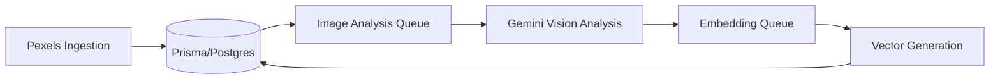
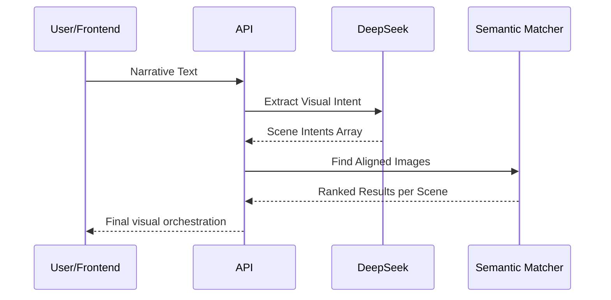

# Vision-IQ: NestJS API Guide

This document serves as the primary technical guide for the Vision-IQ NestJS API, exploring its architecture, core logic, and development workflows.

---

## 🌟 Service Overview

The NestJS API is the central orchestrator of the Vision-IQ ecosystem. It handles:

- **Narrative Analysis**: Parsing raw conversational text into structured visual intents.
- **Image Ingestion**: Synchronizing and rate-limiting image data from external providers (Pexels).
- **AI Enrichment**: Managing asynchronous queues for image analysis (Gemini) and vector embedding generation.
- **Semantic Search**: Matching narrative scenes to the most relevant images using high-dimensional vector similarity and cinematic metadata.

---

## 🏗️ Architecture & Modules

The application is built with a modular NestJS architecture, ensuring clear separation of concerns:

| Module                   | Responsibility                                                    | key Files                                         |
| ------------------------ | ----------------------------------------------------------------- | ------------------------------------------------- |
| **Alignment**            | Core business orchestration and HTTP API surface.                 | `alignment.service.ts`, `alignment.controller.ts` |
| **DeepSeek Integration** | Converts narrative text to structured `SceneIntent` objects.      | `deepseek.service.ts`                             |
| **Image Analysis**       | Extracts visual features (composition, mood, tags) using Gemini.  | `gemini-analysis.service.ts`                      |
| **Semantic Matching**    | Handles vector search and the multi-factor ranking formula.       | `semantic-matching.service.ts`                    |
| **Pexels Sync**          | Manages external image ingestion with pagination and rate limits. | `pexels-integration.service.ts`                   |
| **Queue**                | Background job processing powered by BullMQ and Redis.            | `queue.service.ts`                                |

---

## 🧠 Core Concepts & Formulas

### 1. The Ranking Formula

Visual matching isn't just about keywords; it's about cinematic alignment. The system ranks images based on a weighted combination of factors:

```
final_score =
    (0.50 × vector_similarity)
  + (0.30 × impact_relevance)
  + (0.15 × composition_match)
  + (0.05 × mood_consistency)
```

- **Vector Similarity**: Cosine distance between scene embedding and image embedding.
- **Impact Relevance**: Closeness of the image's "subject prominence" to the scene's requirement.
- **Composition Match**: Matching shot types (Close-Up, Wide), angles, and negative space.
- **Mood Consistency**: Ensuring visual flow across a sequence of images.

### 2. Visual Anchor Logic

To maintain visual coherence in a video sequence, the first image matched for a project establishes a **Mood Anchor**.

- Subsequent images in the sequence are evaluated against this anchor's `MoodDna` (color temperature, primary color).
- Deviations attract a "soft penalty" in the ranking score, encouraging visual continuity without causing hard deadlocks.

---

## 🚦 Core Flows

### Image Processing Pipeline



### Alignment Flow



---

## 📡 API Reference

The service exposes the following primary endpoints for orchestration:

| Endpoint                           | Method | Description                                                     |
| ---------------------------------- | ------ | --------------------------------------------------------------- |
| `/alignment/extract-visual-intent` | POST   | Parses raw narrative text into structured scene intents.        |
| `/alignment/find-images`           | POST   | Searches for and ranks images based on a list of scene intents. |
| `/alignment/sync-pexels`           | POST   | Triggers a background sync of images from the Pexels API.       |
| `/alignment/stats`                 | GET    | Returns statistics on the image library and processing status.  |

---

## 🛠️ Development Setup

### Prerequisites

- **Node.js**: v18+
- **Redis**: Required for BullMQ job queues.
- **PostgreSQL**: Must have the `pgvector` extension enabled.

### Environment Configuration

Key variables in `@repo/env` or `.env`:

- `PORT`: (default: 4000)
- `DATABASE_URL`: PostgreSQL connection string.
- `REDIS_URL`: Redis connection string.
- `GEMINI_API_KEY`: For image analysis.
- `DEEPSEEK_API_KEY`: For narrative parsing.
- `PEXELS_API_KEY`: For image library synchronization.

### Common Scripts

Run these from `apps/nestjs-api`:

- `pnpm run dev`: Start development server with watch mode.
- `pnpm run build`: Compile for production.
- `pnpm run test`: Execute Jest unit tests.
- `pnpm run lint`: Check code quality with Biome.

---

## 🔍 Further Reading

- [Implementation Summary](./src/IMPLEMENTATION_SUMMARY.md): Detailed technical breakdown of recent features.
- [Flow Documentation](./src/flow.md): Deep dive into mermaid diagrams for all system flows.
- [Database Schema](../../packages/database/prisma/schema.prisma): Core models for images, metadata, and embeddings.
