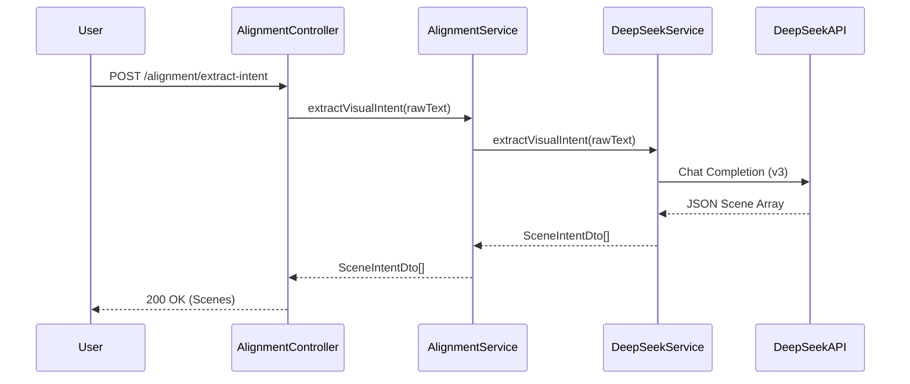
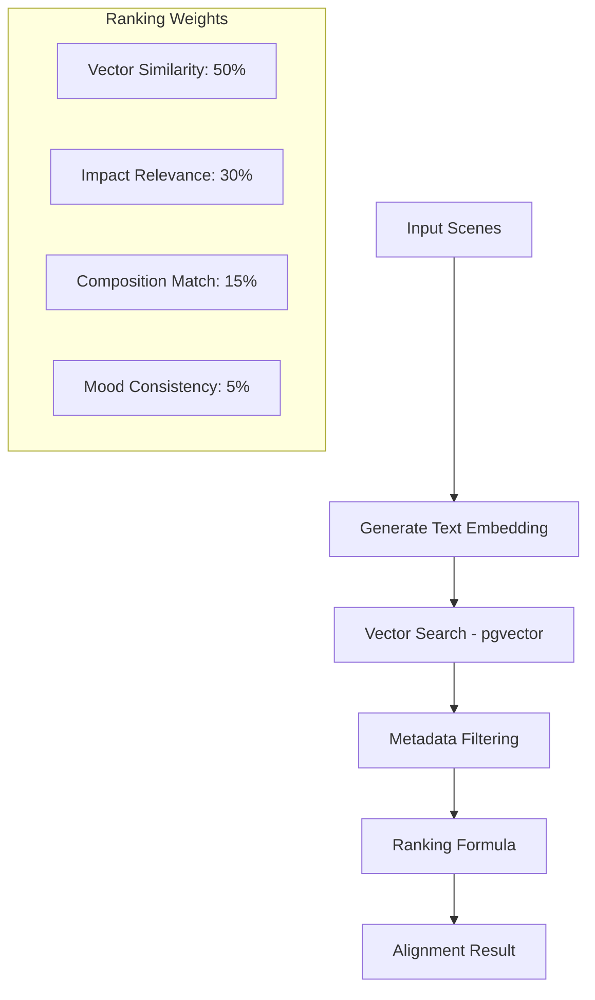
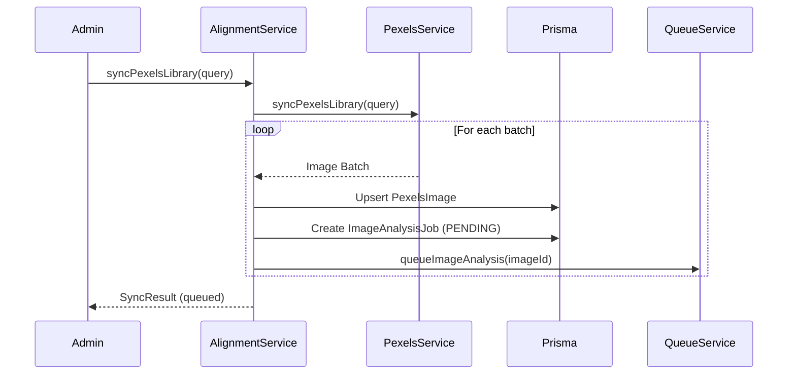
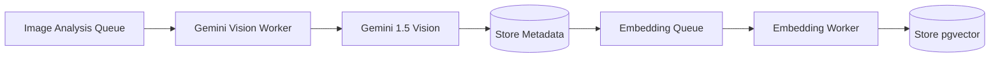

# NestJS API Core Flows

This document outlines the primary architectural flows within the Vision-IQ NestJS API.

## 1. Narrative Extraction Flow

Processes raw conversational text (e.g., from Gemini Live) into structured scenes for visual orchestration.

## 2. Semantic Image Matching Flow

Finds the most relevant images for a sequence of scenes using vector similarity and cinematic metadata.

### Visual Anchor Logic

The first image matched for the first scene establishes a **Mood Anchor**. Subsequent matches are penalized if their `MoodDna` (color temperature, primary color) deviates significantly from this anchor, ensuring visual continuity.

## 3. Library Synchronization Flow

Ingests images from external providers (Pexels) and initiates the analysis pipeline.

## 4. Asynchronous Analysis Pipeline

The background process powered by BullMQ that enriches images with AI-driven metadata.

- **Gemini Vision Worker**: Extracts impact scores, shot types, camera angles, and metaphorical tags.
- **Embedding Worker**: Transforms visual metadata into high-dimensional vectors for semantic search.
