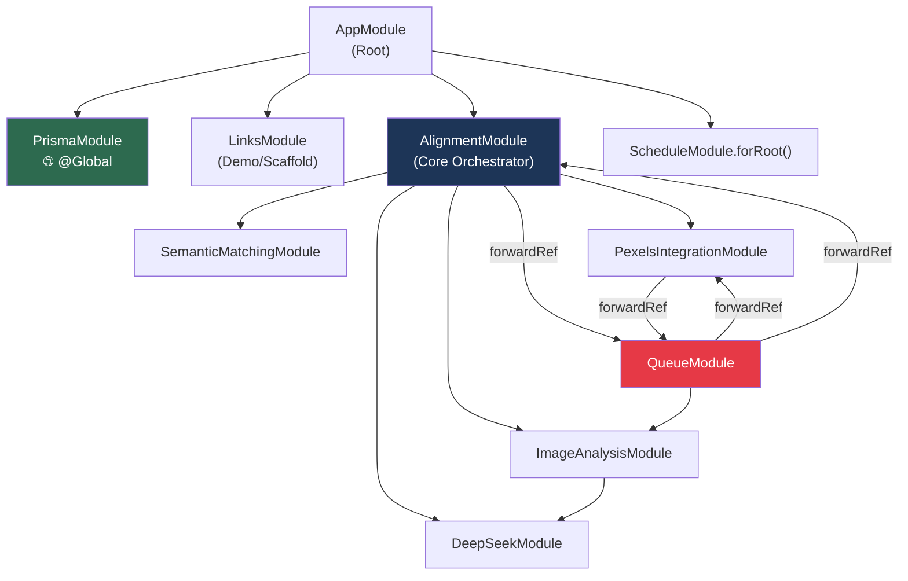
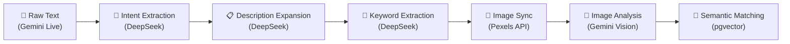
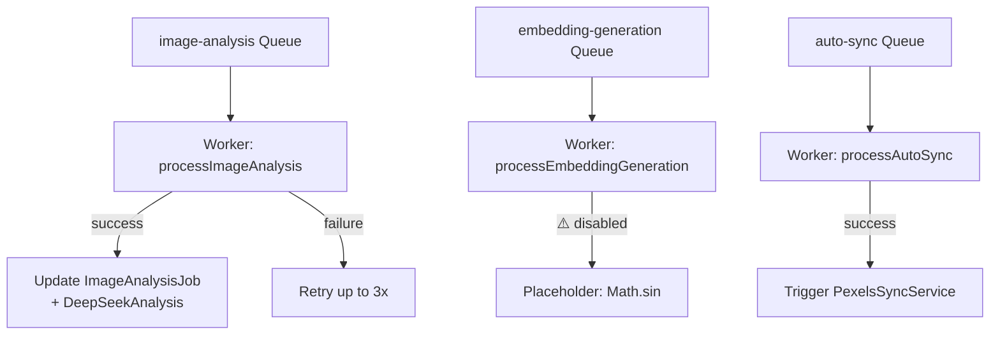
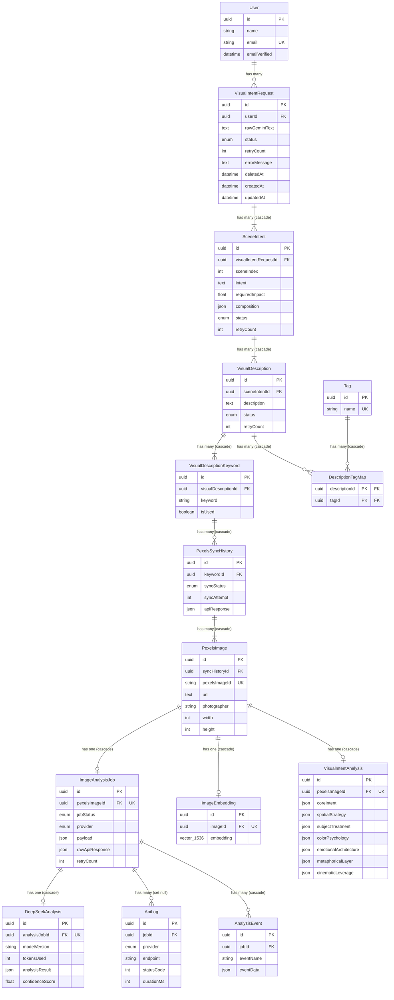
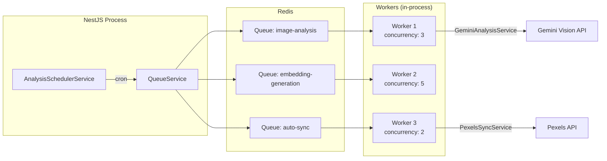

# Vision-IQ NestJS API — Context Document (แบบละเอียด)

> **เอกสารนี้อธิบายบริบททั้งหมดของ `apps/nestjs-api`** ครอบคลุมตั้งแต่โครงสร้าง monorepo, สถาปัตยกรรมภายใน, การไหลของข้อมูล, ฐานข้อมูล, ระบบ Queue, Cron Jobs, การเชื่อมต่อ External APIs, Environment Config และข้อจำกัดที่ทราบ

---

## สารบัญ

1. [Monorepo Overview](#1-monorepo-overview)
2. [NestJS API — Module Architecture](#2-nestjs-api--module-architecture)
3. [Data Pipeline Flow (End-to-End)](#3-data-pipeline-flow-end-to-end)
4. [Module-by-Module Context](#4-module-by-module-context)
5. [Database Schema & ER Diagram](#5-database-schema--er-diagram)
6. [Queue System (BullMQ)](#6-queue-system-bullmq)
7. [Cron Jobs & Scheduled Tasks](#7-cron-jobs--scheduled-tasks)
8. [External API Integrations](#8-external-api-integrations)
9. [Shared Types & Normalization (pipeline-types.ts)](#9-shared-types--normalization-pipeline-typests)
10. [Environment Variables](#10-environment-variables)
11. [Test Coverage Status](#11-test-coverage-status)
12. [Known Limitations & Technical Debt](#12-known-limitations--technical-debt)
13. [File Map](#13-file-map)

---

## 1. Monorepo Overview

Vision-IQ ใช้ **Turborepo + pnpm workspaces** จัดการ monorepo

```
vision-iq/
├── apps/
│   └── nestjs-api/          ← NestJS backend (บทนี้)
├── packages/
│   ├── database/            ← Prisma schema, migrations, generated client
│   ├── env/                 ← Shared environment variable definitions
│   ├── api/                 ← Shared DTOs/types
│   ├── logger/              ← Shared logging utilities
│   └── shared/              ← Cross-cutting utilities
├── docs/                    ← Documentation
├── scripts/                 ← Utility scripts
├── turbo.json               ← Turborepo pipeline config
├── pnpm-workspace.yaml      ← Workspace definition
└── package.json             ← Root package.json
```

### Package Dependencies

| Package          | Import Path         | Purpose                           |
| ---------------- | ------------------- | --------------------------------- |
| `@repo/database` | `packages/database` | Prisma Client, Schema, Migrations |
| `@repo/env`      | `packages/env`      | Environment variables (type-safe) |
| `@repo/api`      | `packages/api`      | Shared DTOs / API types           |

---

## 2. NestJS API — Module Architecture

### Module Dependency Graph



### Application Entrypoint

**`main.ts`** — โหลด `@repo/env` ก่อน → สร้าง NestJS app → เปิด CORS → listen บน port จาก `env.NESTJS_API_PORT`

```typescript
// ขั้นตอนการ boot
1. await import("@repo/env")     // โหลด env ก่อน
2. NestFactory.create(AppModule) // สร้าง app
3. app.enableCors()              // เปิด CORS (all origins)
4. app.listen(env.NESTJS_API_PORT)
```

---

## 3. Data Pipeline Flow (End-to-End)

Vision-IQ แปลง **ข้อความเล่าเรื่อง (narrative text)** ให้เป็น **ภาพที่ตรงกับอารมณ์ของเรื่อง** ผ่าน 5 ขั้นตอน:



### Step-by-Step Pipeline

#### Step 1: Visual Intent Extraction

- **Input**: ข้อความดิบจาก Gemini Live (เช่น "ชายคนหนึ่งยืนอยู่กลางทุ่งข้าวสาลี ท้องฟ้าเป็นสีส้มยามพระอาทิตย์ตก")
- **Service**: `AlignmentService.extractVisualIntent()` → `DeepSeekService.extractVisualIntent()`
- **Output**: Array ของ `SceneIntentDto` ที่มี intent, required_impact, preferred_composition
- **DB Write**: สร้าง `VisualIntentRequest` + `SceneIntent` records
- **Status Tracking**: `PipelineStatus.PENDING` → `IN_PROGRESS` → `COMPLETED`

#### Step 2: Description Expansion (One-to-Many)

- **Input**: SceneIntent ที่ได้จาก Step 1
- **Service**: `DeepSeekService.expandSceneIntent()`
- **Output**: หลาย VisualDescription ต่อ 1 SceneIntent
- **ตัวอย่าง**: intent "คนเหงา" → ขยายเป็น "silhouette noir ในเมือง", "คนนั่งริมผา golden hour", "ภาพ close-up มือจับแก้วกาแฟว่าง"
- **DB Write**: สร้าง `VisualDescription` records

#### Step 3: Keyword Extraction & Auto-Sync

- **Input**: VisualDescription
- **Service**: `DeepSeekService.extractSearchKeywords()` → `PexelsSyncService.syncPexelsLibrary()`
- **Output**: Keywords สำหรับค้นหาภาพจาก Pexels
- **DB Write**: สร้าง `VisualDescriptionKeyword` records
- **Trigger**: ถ้าเปิด `auto_match=true` จะ sync ภาพจาก Pexels ทันที

#### Step 4: Image Analysis (Background/Async)

- **Input**: PexelsImage ที่โหลดเข้ามา
- **Service**: `QueueService` → BullMQ Worker → `GeminiAnalysisService.analyzeImage()`
- **Process**:
  1. Fetch ภาพ → แปลงเป็น base64
  2. ส่งไป Gemini Vision (Live Session) พร้อม prompt เฉพาะ
  3. Parse response เป็น `GeminiAnalysisResult` (impact_score, composition, mood_dna, etc.)
  4. (Optional) Refine ด้วย DeepSeek 7-layer analysis → `VisualIntentAnalysis`
- **DB Write**: `ImageAnalysisJob`, `DeepSeekAnalysis`, `VisualIntentAnalysis`

#### Step 5: Semantic Matching

- **Input**: `SceneIntentDto[]` + embedding ของ scene
- **Service**: `SemanticMatchingService.findAlignedImages()`
- **Process**:
  1. Generate embedding ของ scene (placeholder: random vector)
  2. pgvector cosine similarity search
  3. Multi-factor ranking: `0.5×vector_sim + 0.3×impact + 0.15×composition + 0.05×mood`
  4. Visual Anchor Logic: ภาพแรก lock mood_dna สำหรับ scene ถัดไป
- **Output**: `ImageMatch[][]` — ภาพที่เรียงตาม match_score สำหรับแต่ละ scene

---

## 4. Module-by-Module Context

### 4.1 PrismaModule (`src/prisma/`)

| Item          | Detail                                                                                   |
| ------------- | ---------------------------------------------------------------------------------------- |
| **Pattern**   | `@Global()` module — inject ได้ทุก module                                                |
| **Providers** | `PG_POOL` (raw pg Pool), `PrismaClient` (via PrismaPg adapter), `PRISMA_SERVICE` (alias) |
| **Adapter**   | `@prisma/adapter-pg` — Prisma ใช้ pg Pool เดียวกับ raw SQL                               |
| **SSL**       | `rejectUnauthorized: false` (Supabase dev)                                               |

**Injection Tokens:**

```typescript
export const PG_POOL = "PG_POOL"; // raw pg Pool (SemanticMatchingService ใช้)
export const PRISMA_SERVICE = "PRISMA_SERVICE"; // alias ของ PrismaClient
```

**⚠️ Issue:** มี 3 ways ในการ inject Prisma (PrismaClient class, PRISMA_SERVICE token, PG_POOL) → inconsistent

---

### 4.2 AlignmentModule (`src/alignment/`)

**หน้าที่หลัก:** ตัวกลาง orchestrate ทั้ง pipeline — รับ request → เรียก DeepSeek → สร้าง records → trigger sync

#### Files

| File                      | Lines | Responsibility                   |
| ------------------------- | ----- | -------------------------------- |
| `alignment.module.ts`     | 24    | Module imports/exports           |
| `alignment.controller.ts` | 107   | 8 REST endpoints                 |
| `alignment.service.ts`    | 597   | Core orchestration logic         |
| `cleanup.service.ts`      | 98    | Rollback & cleanup               |
| `dto/scene-intent.dto.ts` | 63    | SceneIntentDto, ImageMatch, etc. |

#### API Endpoints

| Method | Path                                    | Purpose                            | Service Method                     |
| ------ | --------------------------------------- | ---------------------------------- | ---------------------------------- |
| POST   | `/alignment/extract-visual-intent`      | แปลงข้อความ → scene intents        | `extractVisualIntent()`            |
| POST   | `/alignment/test-analysis`              | ทดสอบ Gemini analysis โดยตรง       | `testImageAnalysis()`              |
| POST   | `/alignment/refine-analysis/:jobId`     | Refine analysis ด้วย DeepSeek      | `refineAnalysis()`                 |
| POST   | `/alignment/find-images`                | หาภาพที่ตรงกับ scene intents       | `findAlignedImages()`              |
| POST   | `/alignment/sync-pexels`                | sync ภาพจาก Pexels                 | `syncPexelsLibrary()`              |
| POST   | `/alignment/sync-pexels/:descriptionId` | sync keyword ของ description เฉพาะ | `syncPexelsByDescription()`        |
| POST   | `/alignment/trigger-keyword-sync`       | trigger sync keywords ที่ยังไม่ใช้ | `autoSyncUnusedKeywords()`         |
| GET    | `/alignment/stats`                      | สถิติระบบ                          | `getStats()`                       |
| POST   | `/alignment/rollback/:requestId`        | rollback request + downstream      | `CleanupService.rollbackRequest()` |

#### Key Service Methods

**`extractVisualIntent(dto)`** — 130+ lines of orchestration:

```
1. สร้าง VisualIntentRequest (PENDING)
2. เรียก DeepSeek extractVisualIntent → SceneIntentDto[]
3. Loop each scene:
   a. สร้าง SceneIntent record
   b. เรียก DeepSeek expandSceneIntent → VisualDescription[]
   c. Loop each description:
      - สร้าง VisualDescription record
      - เรียก DeepSeek extractSearchKeywords → keywords
      - สร้าง VisualDescriptionKeyword records
      - ถ้า auto_match → trigger syncPexelsLibrary (fire-and-forget)
4. Update request status → COMPLETED
5. Return SceneIntentDto[]
```

**`autoSyncUnusedKeywords()`** — ค้นหา keywords ที่ `isUsed=false` → trigger sync

**Cron Job:** `@Cron(CronExpression.EVERY_10_SECONDS)` — process pending DeepSeek analysis

---

### 4.3 DeepSeekModule (`src/deepseek-integration/`)

**หน้าที่หลัก:** เรียก DeepSeek API (HTTP REST) สำหรับการวิเคราะห์ข้อความ

#### DeepSeekService (502 lines)

| Method                                     | Input  | Output              | Purpose                            |
| ------------------------------------------ | ------ | ------------------- | ---------------------------------- |
| `extractVisualIntent(rawText)`             | string | `SceneIntentDto[]`  | แปลงข้อความ → scene intents        |
| `expandSceneIntent(intent)`                | string | `SceneIntentDto[]`  | ขยาย 1 intent → หลาย descriptions  |
| `parseGeminiRawResponse(rawResponse)`      | string | structured metadata | parse raw Gemini → structured data |
| `analyzeDetailedVisualIntent(description)` | string | 7-layer analysis    | วิเคราะห์เชิงลึก 7 ชั้น            |
| `extractSearchKeywords(description)`       | string | `string[]`          | สกัด keywords สำหรับค้นหาภาพ       |

**Configuration:**

```
DEEPSEEK_API_KEY    → API key
DEEPSEEK_API_URL    → https://api.deepseek.com/chat/completions
ENABLE_DEEPSEEK     → feature flag (true/false)
```

**Error Handling:** Exponential backoff สำหรับ rate limit (429), retry สูงสุด 3 ครั้ง

**JSON Parsing:** รองรับทั้ง ```json markdown blocks และ raw JSON objects — มี fallback หลายชั้น

---

### 4.4 ImageAnalysisModule (`src/image-analysis/`)

**หน้าที่หลัก:** วิเคราะห์ภาพด้วย Google Gemini Vision API ผ่าน Live Session (WebSocket)

#### GeminiAnalysisService (991 lines)

| Method                                       | Purpose                                     |
| -------------------------------------------- | ------------------------------------------- |
| `analyzeImage(imageUrl)`                     | วิเคราะห์ภาพ 1 ภาพ → `GeminiAnalysisResult` |
| `analyzeImages(items[])`                     | วิเคราะห์ภาพหลายภาพ (batch)                 |
| `refineWithDeepSeek(jobId)`                  | ส่ง raw response ไป parse ด้วย DeepSeek     |
| `analyzeVisualIntent(imageUrl, description)` | 7-layer cinematic analysis                  |

**Gemini Live Session Pattern:**

```typescript
// 1. Connect via WebSocket
const session = await ai.live.connect({
  model: "gemini-2.0-flash-001",
  config: { responseModalities: [Modality.TEXT] },
  callbacks: { onopen, onmessage, onclose, onerror },
});

// 2. Send image data (base64) + prompt
session.sendRealtimeInput({ media: { data: imageBase64, mimeType } });

// 3. Wait for turnComplete
// 4. Collect streamed text
// 5. Close session
```

**Retry Logic:** `runLiveSessionWithRetry()` — retry สูงสุด 5 ครั้ง, delay escalation 2s→4s→6s→8s→10s

**Response Parsing:**

```
1. Primary: parseRawTextResponse() — format "IMPACT: 8\nCOMPOSITION:\n..."
2. Fallback: extractJson() → JSON.parse() → normalizeGeminiResult()
3. Last resort: normalizeGeminiResult({}) → safe defaults
```

**Configuration:**

```
GEMINI_API_KEY   → Google AI API key
ENABLE_GEMINI    → feature flag (true/false)
```

---

### 4.5 PexelsIntegrationModule (`src/pexels-sync/`)

**หน้าที่หลัก:** ดึงภาพจาก Pexels API + จัดเก็บ + queue analysis jobs

#### PexelsIntegrationService (243 lines)

| Method                       | Purpose                                         |
| ---------------------------- | ----------------------------------------------- |
| `syncPexelsLibrary*(query)`  | AsyncGenerator — yield batches ของภาพจาก Pexels |
| `getPexelsPage(query, page)` | fetch 1 page จาก Pexels API (rate limited)      |

**Rate Limiting:** 200 requests/hr → min interval 18s ต่อ request  
**Retry:** Exponential backoff สำหรับ 429, max 3 retries

#### PexelsSyncService (256 lines)

| Method                                                          | Purpose                          |
| --------------------------------------------------------------- | -------------------------------- |
| `syncPexelsLibrary(query, batchSize, descriptionId, keywordId)` | orchestrate sync + ingestion     |
| `ingestionBatch(images, needsAnalysis)`                         | upsert ภาพ + สร้าง analysis jobs |

**Process:**

```
1. สร้าง PexelsSyncHistory (ถ้ามี keywordId)
2. Iterate batches จาก PexelsIntegrationService
3. ทุก batch → ingestionBatch():
   a. upsert PexelsImage (by pexelsImageId)
   b. ถ้า needsAnalysis → สร้าง ImageAnalysisJob → queue ใน BullMQ
4. Update SyncHistory status
5. Mark keyword isUsed=true
```

**Configuration:**

```
PEXELS_API_KEY            → Pexels API key
ENABLE_PEXELS             → feature flag
PEXELS_REQUESTS_PER_HOUR  → rate limit (default: 200)
PEXELS_RETRY_DELAY_MS     → base retry delay (default: 1000)
```

---

### 4.6 QueueModule (`src/queue/`)

**หน้าที่หลัก:** จัดการ background job processing ด้วย BullMQ + Redis

#### QueueService (485 lines)

**Queues สร้างขึ้น 3 ตัว:**

| Queue Name             | Purpose                       | Concurrency |
| ---------------------- | ----------------------------- | ----------- |
| `image-analysis`       | วิเคราะห์ภาพด้วย Gemini       | 3           |
| `embedding-generation` | สร้าง vector embeddings       | 5           |
| `auto-sync`            | trigger Pexels sync อัตโนมัติ | 2           |

**Job Processing Flow:**



**⚠️ Embedding generation ถูก disable:** method `processEmbeddingGeneration` ใช้ `Math.sin()` placeholder

#### AnalysisSchedulerService (166 lines)

**Cron Jobs 3 ตัว:**

| Cron                         | Interval     | Method                     | Purpose                                       |
| ---------------------------- | ------------ | -------------------------- | --------------------------------------------- |
| `handleUnusedKeywords`       | Every 5 min  | `autoSyncUnusedKeywords()` | sync keywords ที่ `isUsed=false`              |
| `handlePendingJobs`          | Every 5 min  | re-queue pending jobs      | jobs ที่ค้าง PENDING                          |
| `handleStalledOrchestration` | Every 10 min | `resumeProcessing()`       | resume requests/scenes/descriptions ที่ stall |

---

### 4.7 SemanticMatchingModule (`src/semantic-matching/`)

**หน้าที่หลัก:** ค้นหาภาพที่ตรงกับ scene intent ด้วย vector similarity + metadata ranking

#### SemanticMatchingService (401 lines)

**Injection:** `@Inject(PG_POOL)` — ใช้ raw SQL กับ pgvector โดยตรง (ไม่ผ่าน Prisma)

**Ranking Formula:**

```
final_score = (0.50 × vector_similarity)
            + (0.30 × impact_relevance)
            + (0.15 × composition_match)
            + (0.05 × mood_consistency × mood_multiplier)

weighted_final_score = final_score × (0.8 + intentDepthScore × 0.2)
```

**Visual Anchor Logic:**

```
Scene 1: เลือกภาพที่ดีที่สุด → lock mood_dna เป็น "visual anchor"
Scene 2+: ใช้ mood_dna ของ anchor เป็น constraint →
          ภาพที่มี mood ใกล้เคียง anchor ได้คะแนน mood_consistency สูงกว่า
```

**Composition Match Scoring:**

| Match                       | Score |
| --------------------------- | ----- |
| Exact shot_type match       | +0.5  |
| Adjacent shot_type (1 step) | +0.25 |
| Exact angle match           | +0.5  |
| Any other angle             | +0.1  |

**⚠️ Known Issue:** `generateEmbeddingForScene()` return random 1536-dim vector (placeholder)

---

### 4.8 LinksModule (`src/links/`)

**Status:** Scaffold/Demo — ไม่ได้ใช้จริง

- CRUD controller + service
- ข้อมูลเป็น hardcoded in-memory array
- มี TODO comments สำหรับ implement จริง

---

## 5. Database Schema & ER Diagram

### ER Diagram



### Data Lineage (Cascade Chain)

```
User
 └── VisualIntentRequest (onDelete: SetNull)
      └── SceneIntent (onDelete: Cascade)
           └── VisualDescription (onDelete: Cascade)
                ├── VisualDescriptionKeyword (onDelete: Cascade)
                │    └── PexelsSyncHistory (onDelete: Cascade)
                │         └── PexelsImage (onDelete: Cascade) ⚠️
                │              ├── ImageAnalysisJob (onDelete: Cascade)
                │              │    ├── DeepSeekAnalysis (onDelete: Cascade)
                │              │    ├── ApiLog (onDelete: SetNull)
                │              │    └── AnalysisEvent (onDelete: Cascade)
                │              ├── ImageEmbedding (onDelete: Cascade)
                │              └── VisualIntentAnalysis (onDelete: Cascade)
                └── DescriptionTagMap (onDelete: Cascade)
```

> **⚠️ Cascade Risk:** การลบ `PexelsSyncHistory` จะ cascade ลบ PexelsImage ทั้งหมดที่เกี่ยวข้อง + analysis + embeddings

### Enums

| Enum             | Values                                                              |
| ---------------- | ------------------------------------------------------------------- |
| `PipelineStatus` | `PENDING`, `QUEUED`, `PROCESSING`, `COMPLETED`, `FAILED`, `STALLED` |
| `ApiProvider`    | `PEXELS`, `DEEPSEEK`, `OPENAI`, `GEMINI`                            |

### Table Naming Convention

ทุกตารางใช้ prefix `vision_iq_` ผ่าน `@@map()`:

```
vision_iq_users
vision_iq_visual_intent_requests
vision_iq_scene_intents
vision_iq_visual_descriptions
vision_iq_visual_description_keywords
vision_iq_pexels_sync_history
vision_iq_pexels_images
vision_iq_image_analysis_jobs
vision_iq_deepseek_analysis
vision_iq_api_logs
vision_iq_analysis_events
vision_iq_tags
vision_iq_description_tag_map
vision_iq_visual_intent_analysis
vision_iq_image_embeddings
```

---

## 6. Queue System (BullMQ)

### Architecture



### Job Options

| Queue                  | Attempts | Backoff         | Remove on Complete |
| ---------------------- | -------- | --------------- | ------------------ |
| `image-analysis`       | 3        | exponential, 2s | last 100           |
| `embedding-generation` | 3        | exponential, 2s | last 100           |
| `auto-sync`            | 2        | exponential, 5s | last 50            |

### Event Listeners

ทุก Queue มี event listeners:

```
completed → log success + jobId + return value
failed → log error + jobId + failedReason
stalled → log warning
error → log error
```

---

## 7. Cron Jobs & Scheduled Tasks

| Job                              | Location                   | Schedule     | Purpose                                              |
| -------------------------------- | -------------------------- | ------------ | ---------------------------------------------------- |
| `handleUnusedKeywords`           | `AnalysisSchedulerService` | Every 5 min  | Sync keywords ที่ `isUsed=false` → queue auto-sync   |
| `handlePendingJobs`              | `AnalysisSchedulerService` | Every 5 min  | Re-queue `PENDING` analysis jobs ที่ค้าง             |
| `handleStalledOrchestration`     | `AnalysisSchedulerService` | Every 10 min | Resume requests/scenes/descriptions ที่ stall        |
| `processPendingDeepSeekAnalysis` | `AlignmentService`         | Every 10 sec | Process completed Gemini jobs → refine ด้วย DeepSeek |

---

## 8. External API Integrations

### DeepSeek API

| Item             | Detail                                                                    |
| ---------------- | ------------------------------------------------------------------------- |
| **Protocol**     | HTTP REST (axios)                                                         |
| **Endpoint**     | `DEEPSEEK_API_URL` (default: `https://api.deepseek.com/chat/completions`) |
| **Model**        | DeepSeek-V3 (deepseek-chat)                                               |
| **Auth**         | Bearer token (`DEEPSEEK_API_KEY`)                                         |
| **Rate Limit**   | Exponential backoff on 429                                                |
| **Feature Flag** | `ENABLE_DEEPSEEK`                                                         |

### Google Gemini API

| Item             | Detail                                       |
| ---------------- | -------------------------------------------- |
| **Protocol**     | WebSocket (Live Session) via `@google/genai` |
| **Model**        | `gemini-2.0-flash-001`                       |
| **Auth**         | API key (`GEMINI_API_KEY`)                   |
| **Mode**         | `Modality.TEXT` (response)                   |
| **Retry**        | 5 attempts, delay escalation 2s→10s          |
| **Feature Flag** | `ENABLE_GEMINI`                              |

### Pexels API

| Item             | Detail                                           |
| ---------------- | ------------------------------------------------ |
| **Protocol**     | HTTP REST (axios)                                |
| **Endpoint**     | `https://api.pexels.com/v1/search`               |
| **Auth**         | API key in `Authorization` header                |
| **Rate Limit**   | 200 req/hr (client-side enforced, ~18s interval) |
| **Retry**        | 3 attempts, exponential backoff on 429           |
| **Feature Flag** | `ENABLE_PEXELS`                                  |

### Redis

| Item         | Detail                                          |
| ------------ | ----------------------------------------------- |
| **Protocol** | Redis protocol                                  |
| **URL**      | `REDIS_URL` (default: `redis://localhost:6379`) |
| **Usage**    | BullMQ queues + workers                         |

### PostgreSQL

| Item          | Detail                             |
| ------------- | ---------------------------------- |
| **Protocol**  | PostgreSQL                         |
| **URL**       | `DATABASE_URL` (via `process.env`) |
| **ORM**       | Prisma + raw pg Pool               |
| **Extension** | pgvector (สำหรับ embedding search) |
| **SSL**       | `rejectUnauthorized: false`        |

---

## 9. Shared Types & Normalization (pipeline-types.ts)

**File:** `src/shared/pipeline-types.ts` (186 lines)

### Core Types

```typescript
// Composition — 5 fields
interface Composition {
  negative_space: "left" | "right" | "center";
  shot_type: "CU" | "MS" | "WS";
  angle: "low" | "eye" | "high";
  balance: "symmetrical" | "asymmetrical";
  subject_dominance: "weak" | "moderate" | "strong";
}

// MoodDna — 5 fields
interface MoodDna {
  temp: "warm" | "cold";
  primary_color: string; // hex e.g. "#E8D4C0"
  vibe: string; // e.g. "minimalist"
  emotional_intensity: string; // "low" | "medium" | "strong"
  rhythm: string; // "calm" | "dynamic" | "tense"
}

// ColorProfile — 4 fields
interface ColorProfile {
  temperature: "warm" | "cold";
  primary_color: string;
  secondary_colors: string[];
  contrast_level: "low" | "medium" | "high";
}

// GeminiAnalysisResult — canonical analysis output
interface GeminiAnalysisResult {
  impact_score: number; // 1-10
  visual_weight: number; // 1-10
  composition: Composition;
  color_profile: ColorProfile;
  mood_dna: MoodDna;
  metaphorical_tags: string[];
  cinematic_notes: string;
}
```

### Normalization Functions

| Function                                              | Purpose                                                                     |
| ----------------------------------------------------- | --------------------------------------------------------------------------- |
| `normalizeGeminiResult(parsed)`                       | Any → `GeminiAnalysisResult` with safe defaults                             |
| `normalizeComposition(comp)`                          | Any → `Composition` with defaults (center, MS, eye, asymmetrical, moderate) |
| `normalizeMoodDna(mood, fallbackTemp, fallbackColor)` | Any → `MoodDna` with defaults                                               |

**ทั้ง 3 functions รองรับ partial/missing/malformed data** — ทุก field มี default value

---

## 10. Environment Variables

| Variable                   | Required | Default                                     | Used By                               |
| -------------------------- | -------- | ------------------------------------------- | ------------------------------------- |
| `DATABASE_URL`             | ✅       | —                                           | PrismaModule (pg Pool)                |
| `NESTJS_API_PORT`          | ✅       | —                                           | main.ts                               |
| `REDIS_URL`                | ✅       | —                                           | QueueService (BullMQ)                 |
| `DEEPSEEK_API_KEY`         | ⚠️       | `""`                                        | DeepSeekService                       |
| `DEEPSEEK_API_URL`         | ⚠️       | `https://api.deepseek.com/chat/completions` | DeepSeekService                       |
| `ENABLE_DEEPSEEK`          | No       | `false`                                     | DeepSeekService feature flag          |
| `GEMINI_API_KEY`           | ⚠️       | —                                           | GeminiAnalysisService                 |
| `ENABLE_GEMINI`            | No       | `false`                                     | GeminiAnalysisService feature flag    |
| `PEXELS_API_KEY`           | ⚠️       | `""`                                        | PexelsIntegrationService              |
| `ENABLE_PEXELS`            | No       | `false`                                     | PexelsIntegrationService feature flag |
| `PEXELS_REQUESTS_PER_HOUR` | No       | `200`                                       | PexelsIntegrationService              |
| `PEXELS_RETRY_DELAY_MS`    | No       | `1000`                                      | PexelsIntegrationService              |
| `BATCH_FAILURE_THRESHOLD`  | No       | `0.1`                                       | PexelsSyncService                     |
| `AUTH_SECRET`              | No       | —                                           | (ยังไม่ได้ใช้ใน nestjs-api)           |

---

## 11. Test Coverage Status

### Existing Tests

| File                           | Lines | Coverage                                                        |
| ------------------------------ | ----- | --------------------------------------------------------------- |
| `alignment.controller.spec.ts` | 94    | 4 test cases (basic delegation)                                 |
| `alignment.service.spec.ts`    | 243   | 5 test cases (extractVisualIntent, findAlignedImages, getStats) |

### Missing Tests

| Service/Module             | Status      |
| -------------------------- | ----------- |
| `QueueService`             | ❌ No tests |
| `GeminiAnalysisService`    | ❌ No tests |
| `DeepSeekService`          | ❌ No tests |
| `PexelsSyncService`        | ❌ No tests |
| `PexelsIntegrationService` | ❌ No tests |
| `SemanticMatchingService`  | ❌ No tests |
| `CleanupService`           | ❌ No tests |
| `AnalysisSchedulerService` | ❌ No tests |

### Estimated Coverage: **~15-20%**

---

## 12. Known Limitations & Technical Debt

### Critical

| #   | Issue                                                                                                                                  | Location                                  |
| --- | -------------------------------------------------------------------------------------------------------------------------------------- | ----------------------------------------- |
| 1   | **No authentication/authorization** — all endpoints are public                                                                         | All controllers                           |
| 2   | **No input validation** — no `ValidationPipe`, DTOs lack decorators                                                                    | All endpoints                             |
| 3   | **Placeholder embeddings** — `Math.random()` and `Math.sin()` instead of real API                                                      | `SemanticMatchingService`, `QueueService` |
| 4   | **Schema drift** — raw SQL in `SemanticMatchingService` references columns that don't exist in schema (`da.imageId`, `da.impactScore`) | `semantic-matching.service.ts:117-137`    |
| 5   | **No Prisma transactions** — multi-step DB writes without atomicity                                                                    | `AlignmentService.extractVisualIntent`    |

### Moderate

| #   | Issue                                                           | Location                                           |
| --- | --------------------------------------------------------------- | -------------------------------------------------- |
| 6   | 3 circular dependency chains (via `forwardRef`)                 | Module imports                                     |
| 7   | Hardcoded magic numbers (batch sizes, retry counts, thresholds) | Throughout services                                |
| 8   | Fire-and-forget async calls (no `await`)                        | `AlignmentService` line 136-149                    |
| 9   | CORS open to all origins                                        | `main.ts`                                          |
| 10  | `console.log()` instead of NestJS Logger                        | `prisma.module.ts`, `semantic-matching.service.ts` |
| 11  | No request correlation ID / structured logging                  | All services                                       |
| 12  | Embedding column commented out in Prisma but used in raw SQL    | `schema.prisma:303`                                |

### Low

| #   | Issue                                                               |
| --- | ------------------------------------------------------------------- |
| 13  | `LinksModule` is scaffold code (in-memory hardcoded data)           |
| 14  | Debug/test files committed (`debug-getStats.log`, `queue_fail.log`) |
| 15  | Mixed snake_case/camelCase in DTOs                                  |
| 16  | `@ts-ignore` in `AlignmentService`                                  |

---

## 13. File Map

```
apps/nestjs-api/src/
├── main.ts                                     # Application entrypoint
├── app.module.ts                               # Root module
├── app.controller.ts                           # Health check "/"
├── app.service.ts                              # "Hello World"
│
├── prisma/
│   └── prisma.module.ts                        # @Global PrismaClient + PG_POOL
│
├── alignment/
│   ├── alignment.module.ts                     # Core orchestrator module
│   ├── alignment.controller.ts                 # 8 REST endpoints
│   ├── alignment.service.ts                    # 597-line orchestration service
│   ├── alignment.controller.spec.ts            # Controller tests
│   ├── alignment.service.spec.ts               # Service tests
│   ├── cleanup.service.ts                      # Rollback & cleanup
│   └── dto/
│       └── scene-intent.dto.ts                 # SceneIntentDto, ImageMatch, etc.
│
├── deepseek-integration/
│   ├── deepseek.module.ts                      # DeepSeek module
│   └── deepseek.service.ts                     # 502-line DeepSeek API service
│
├── image-analysis/
│   ├── image-analysis.module.ts                # Gemini analysis module
│   └── gemini-analysis.service.ts              # 991-line Gemini Vision service
│
├── pexels-sync/
│   ├── pexels-integration.module.ts            # Pexels module
│   ├── pexels-integration.service.ts           # 243-line Pexels API client
│   └── pexels-sync.service.ts                  # 256-line sync orchestrator
│
├── queue/
│   ├── queue.module.ts                         # BullMQ module
│   ├── queue.service.ts                        # 485-line queue manager
│   └── analysis-scheduler.service.ts           # 166-line cron jobs
│
├── semantic-matching/
│   ├── semantic-matching.module.ts             # Vector search module
│   └── semantic-matching.service.ts            # 401-line pgvector search
│
├── shared/
│   └── pipeline-types.ts                       # 186-line shared types & normalization
│
└── links/
    ├── links.module.ts                         # Demo module (scaffold)
    ├── links.controller.ts                     # Demo CRUD controller
    └── links.service.ts                        # Demo service (in-memory)
```

---

> **Document Version:** 1.0  
> **Last Updated:** 2026-02-14  
> **Scope:** `apps/nestjs-api` only (ไม่รวม frontend apps)
