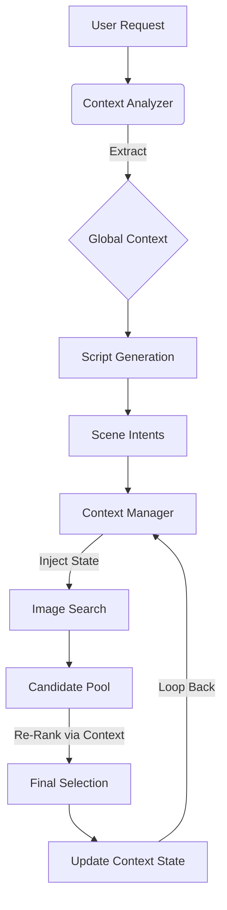

# Vision-IQ Context System Reference

> **Context** in Vision-IQ refers to the stateful information that persists across the narrative generation pipeline, ensuring coherence, continuity, and logical progression in visual storytelling.

---

## 1. Core Philosophy: Context-Aware vs. Greedy Selection

| Feature            | Greedy Selection (Current State)    | Context-Aware Selection (Target State)   |
| :----------------- | :---------------------------------- | :--------------------------------------- |
| **Decision Scope** | Isolated Scene (Local Optimization) | Full Narrative Arc (Global Optimization) |
| **Continuity**     | Accidental / Random                 | Intentional / Managed                    |
| **Visual Flow**    | Disjointed ("Slide Show")           | Cinematic ("Movie")                      |
| **Memory**         | None (Stateless)                    | Stateful (Short & Long Term)             |

The **Context System** transforms the engine from a simple "Image Search" tool into a "Visual Director" that understands:

1.  **Where we came from** (Previous scenes)
2.  **Where we are** (Current emotional beat)
3.  **Where we are going** (Narrative climax/resolution)

---

## 2. Context Layers

The efficient management of Context requires distinct layers of abstraction:

### Layer 1: Global Narrative Context (The "Script")

_Scope: Entire Video Request_

- **Genre:** Documentary, Cinematic Vlog, Corporate, Horror.
- **Core Theme:** "Economic Collapse", "Hope for Future", "Technological Singularity".
- **Pacing Strategy:** Slow build-up → Fast cuts → Slow resolution.
- **Visual Anchor:** A defined palette or style guide (e.g., "Cyberpunk", "Desaturated Kodak Film").

### Layer 2: Temporal Context (The "Timeline")

_Scope: Sliding Window of Scenes (Previous N, Next M)_

- **Visual Continuity:** Ensuring Scene N+1 flows naturally from Scene N (e.g., matching lighting direction, color temperature).
- **Subject Permanence:** Tracking key subjects (e.g., "The Protagonist") to ensure they don't change appearance randomly.
- **Transition Logic:** Determining how to get from Shot A to Shot B (Cut, Dissolve, Match Cut).

### Layer 3: Semantic Context (The "Meaning")

_Scope: Deep Understanding of Intent_

- **Metaphorical Alignment:** Understanding that "The market is crashing" can be visualized as "Falling rocks" (Metaphor) or "Red graph" (Literal).
- **Emotional Arc:** Tracking the intensity curve (Calm → Tense → Explosive → Calm).

---

## 3. Data Structures & Models

### `ContextState` Object

This object flows through the pipeline alongside the request.

```typescript
interface ContextState {
  // Global Identifiers
  requestId: string;
  narrativeId: string;

  // The "Director's Vision"
  globalDirectives: {
    genre: "cinematic-documentary";
    visualStyle: "high-contrast-monochrome";
    pacing: "dynamic";
  };

  // State Tracking
  currentBeat: number; // Index in the timeline
  emotionalIntensity: number; // 0.0 - 1.0 (Current arousal level)

  // Memory (Short-term)
  previousScenes: Array<{
    imageId: string;
    visualembedding: number[];
    dominantColor: string;
    subject: string | null;
  }>;

  // Accumulated Cluster Data for Continuity
  activeClusterId: string | null; // e.g., "cluster_financial_panic"
}
```

### `NarrativeCluster` (See "Scene Clustering Analysis")

Groupings of images that share _Contextual Relevance_ rather than just _Keyword Relevance_.

- **Cluster A:** "Wall Street Panic" (Traders, yelling, phones)
- **Cluster B:** "Economic Depression" (Empty streets, closed signs, bw tone)

---

## 4. Implementation Strategy

### 4.1. Injection (Prompt Engineering)

- **Input:** User Request + `ContextState`
- **Action:** When generating specific scene prompts for Gemini/DeepSeek, inject the _Context_ as a system instruction.
  - _Example:_ "Given that the previous scene showed a 'Stormy Ocean', generate a prompt for the next scene that maintains the 'Dark/Blue' color palette but transitions to 'Calm Aftermath'."

### 4.2. Vector Search Re-Ranking (The "Filter")

- Instead of `Select Top 1 by Semantic Similarity`, use:
  ```sql
  Score = (SemanticSimilarity * 0.5)
        + (ContextContinuity * 0.3)
        + (NarrativeArcFit * 0.2)
  ```
- **ContextContinuity:** Distance(CurrentVector, PrevSceneVector) < Threshold.

### 4.3. Visual Coherence Check (The "Gatekeeper")

- Before finalizing a selection, run a lightweight check:
  - _Does Scene N clash with Scene N-1?_ (e.g., Jump from Day to Night without transition time).
  - _Action:_ If clash detected, penalize score or trigger re-roll from the same _Cluster_.

---

## 5. Future Roadmap: The "Memory" Module

To fully realize a Context-Aware Engine, we will need:

1.  **Character LoRA Support:** Injecting specific character definitions into the context to allow for consistent "AI-Generated" actors.
2.  **Long-Term Memory (Vector Store):** Remembering that "User X likes Dark Mode visuals" across _multiple different videos_.
3.  **Feedback Loop:** Learning from user rejections. If a user rejects a "Cartoon" style image in a "Serious" context, update the _Global Context_ to strictly forbid cartoons for this session.

---

### Reference Architecture


