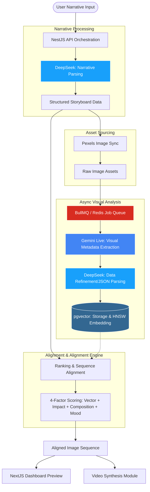

# Vision-IQ Alignment Service Flow

This document illustrates the end-to-end workflow of the Narrative-to-Video Image Alignment Service.

## 🔄 System Flowchart

## 🧩 Component Relationships

| Step              | Component            | Description                                                                 |
| :---------------- | :------------------- | :-------------------------------------------------------------------------- |
| **1. Input**      | **NestJS API**       | Orchestrates the entire lifecycle of a video project.                       |
| **2. Parsing**    | **DeepSeek-V3**      | Breaks down raw text into visual prompts and requirements.                  |
| **3. Sourcing**   | **Pexels API**       | Streams relevant image candidates based on prompts.                         |
| **4. Analysis**   | **Gemini Live**      | Analyzes images for complex attributes (lighting, composition).             |
| **5. Refinement** | **DeepSeek-V3**      | Converts raw Gemini talk into structured metadata (Impact Score, Mood DNA). |
| **6. Search**     | **pgvector**         | Performs semantic similarity search using HNSW indexing.                    |
| **7. Ranking**    | **Alignment Engine** | Custom logic for visual coherence and sequence alignment.                   |
| **8. Display**    | **NextJS**           | Real-time visualization of the results for the user.                        |
