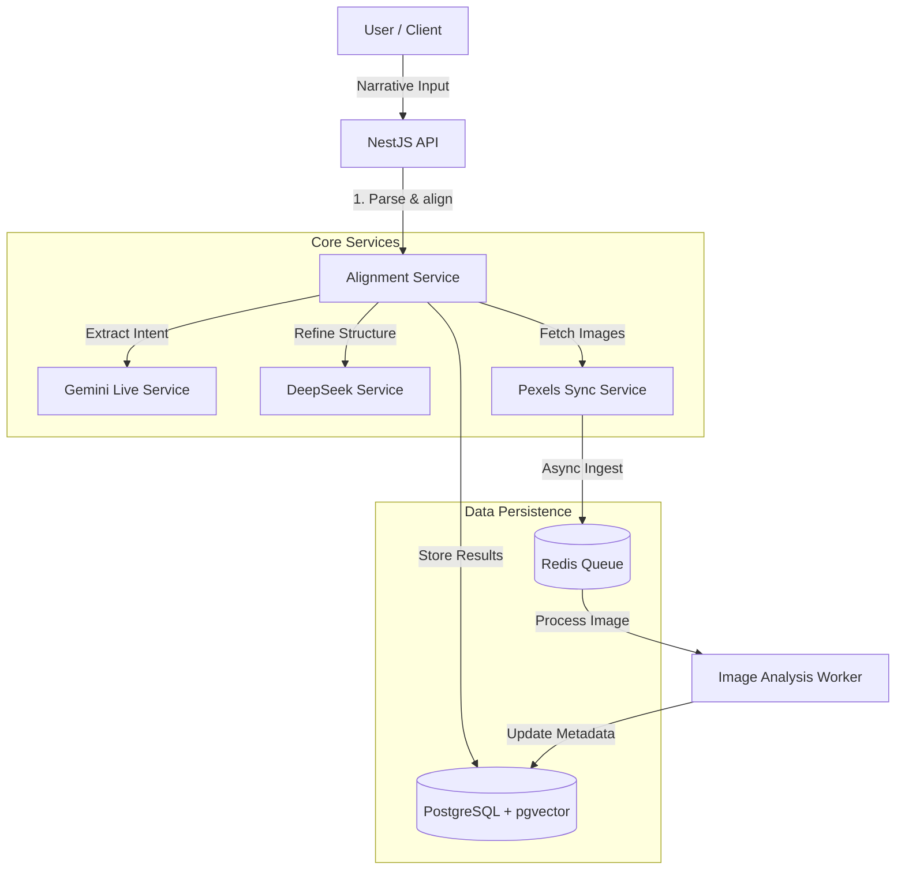
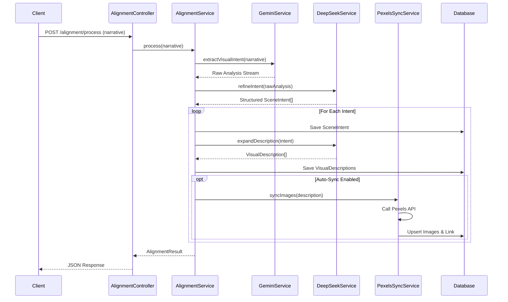
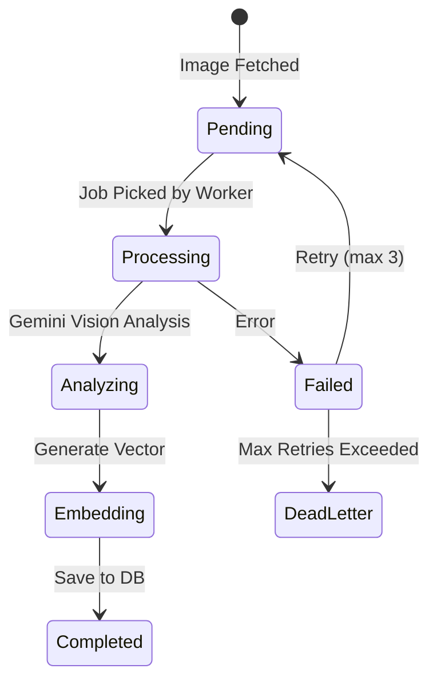
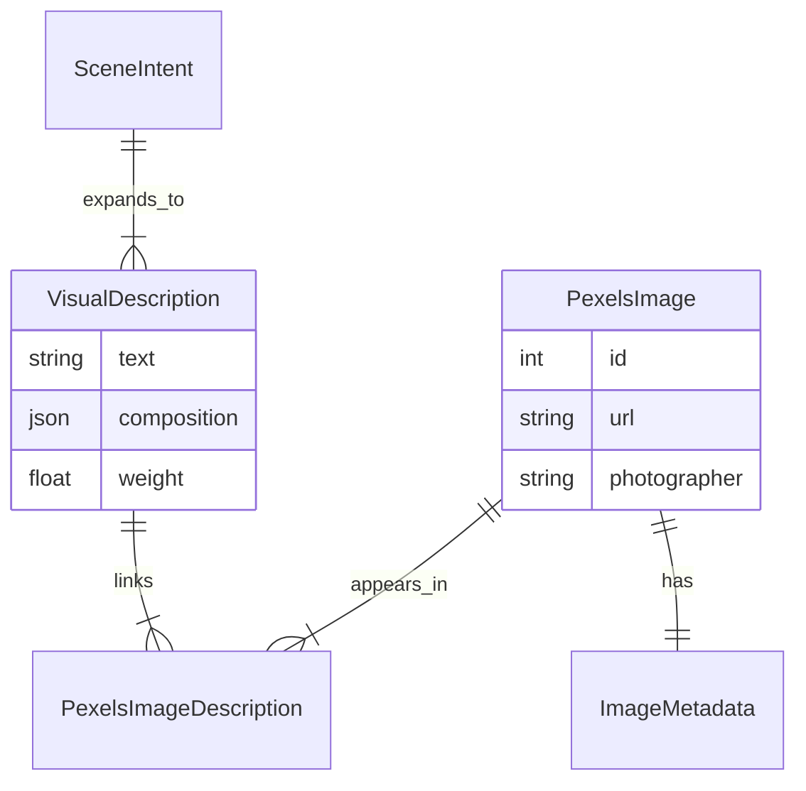

# Vision-IQ Architecture & Flow Diagrams

## 1. High-Level System Architecture

## 2. Alignment Module Workflow

This diagram details the "Visual Intent Extraction" and "Image Alignment" process.

## 3. Image Ingestion & Analysis Pipeline

How images are enriched with metadata after being fetched.

## 4. Entity Relationship (Simplified)

