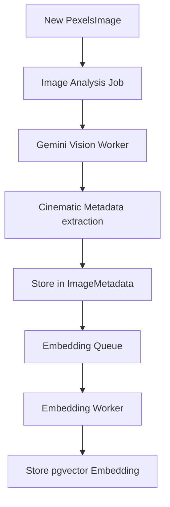
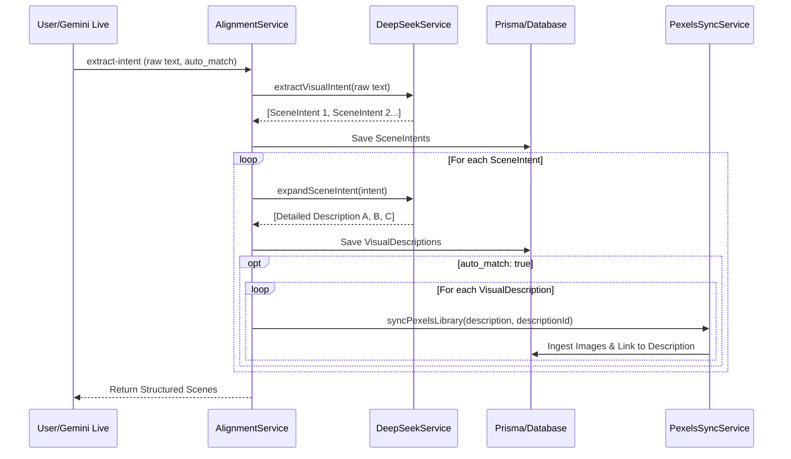

# Vision-IQ Main Architecture Flow

This document provides a comprehensive overview of the Vision-IQ architecture, from raw narrative input to semantically aligned visual assets.

## The End-to-End Orchestration Flow

Vision-IQ transforms textual narratives into a sequence of perfectly matched cinematic images. The flow is designed for high visual fidelity and semantic consistency.

### 1. Visual Intent Extraction

Converts raw conversational or narrative text (e.g., from Gemini Live) into structured scene objects.

- **Service**: `AlignmentService` -> `DeepSeekService`
- **Output**: `SceneIntent` (Stored in `vision_iq_scene_intents`)
- **Process**: DeepSeek-V3 analyzes the narrative to identify key visual moments, extracting basic intent and composition preferences.

### 2. One-to-Many Description Expansion

Expands each single visual intent into multiple highly detailed, cinematic descriptions. This "summarization to expansion" step ensures diverse and high-quality image search coverage.

- **Service**: `DeepSeekService.expandSceneIntent`
- **Output**: `VisualDescription` (Stored in `vision_iq_visual_descriptions`)
- **Benefit**: Each core intent (e.g., "lonely person") is explored through different lighting, environments, and perspectives (e.g., "noir urban silhouette", "golden hour cliffside solitude").

### 3. Semantic Image Alignment & Synchronization

Finds existing images or pulls new ones from external libraries (Pexels) based on the expanded descriptions.

- **Service**: `SemanticMatchingService` & `PexelsSyncService`
- **Tracking**: Every discovered image is linked back to the specific `VisualDescription` that found it via the `PexelsImageDescription` join table. This allows upstream/downstream tracking of image provenance.
- **Auto-Sync**: If `auto_match` is enabled, the system automatically fetches new images from Pexels using the expanded descriptions as search queries. Additionally, a background cron job handles any pending keyword searches for descriptions that weren't immediately synced.

### 4. Asynchronous Pipeline (Enrichment)

Once an image enters the library, it undergoes a background analysis process to extract cinematic metadata.

- **VisualAnchorLogic**: Ensures visual continuity.
- **Automated Keyword Trigger**: Background orchestration (`AnalysisSchedulerService`) that picks up unused keywords from the `vision_iq_visual_description_keywords` table and triggers Pexels syncs to fill gaps in the library.
- **OrchestrationStatus**: Tracks the lifecycle of requests, scenes, and descriptions (`PENDING`, `IN_PROGRESS`, `COMPLETED`, `FAILED`).

## Sequence Diagram: Visual Orchestration

## Key Data Models for Tracking

- **SceneIntent**: The high-level visual moment.
- **VisualDescription**: The detailed prompt variants (1:N with SceneIntent).
- **PexelsImageDescription**: Join table linking `PexelsImage` to `VisualDescription` for provenance tracking.
